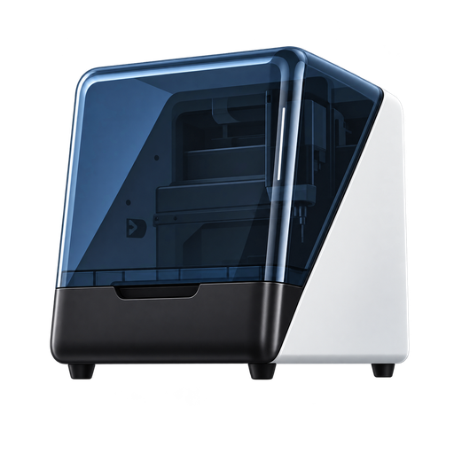

# HAkera

<p align="center">
  
</p>

HAkera is a Home Assistant custom integration for monitoring Makera Z1 CNC
machines and controlling non-motion accessories over the local network. It
supports the Z1 product family and was developed and tested on a Z1 Pro.

> [!CAUTION]
> HAkera is provided as-is and is not a safety system. Camera feeds, telemetry,
> network connections, and automations may fail, be delayed, or report stale
> information. You are responsible for operating the machine safely and
> following the manufacturer's guidance. Use HAkera at your own risk.
>
> HAkera does not expose motion, spindle-motor, tool-change, probing, file,
> G-code, or job controls. Home Assistant automations can run without an
> operator present, so machine control remains deliberately out of scope.

## Compatibility

Live tested with:

- Makera Z1 Pro
- Z1 firmware `1.1.2.0.1.13`
- Home Assistant `2026.8.3`

Other Z1 models and firmware versions may work but have not yet been verified.

## Features

- Machine, alarm, lid, emergency-stop, spindle, temperature, and diagnostic
  monitoring
- Automation-focused activity, idle/clear, spindle-speed, and controller events
- On-demand camera stills and live MJPEG video
- Camera resolution selection from `160x120` through `1600x1200`
- Work-light control and feedback
- Spindle-fan and control-box-fan control and feedback
- External-output control and feedback for accessories such as a vacuum
- Optional machine and work coordinates, disabled by default

## Installation

### HACS

1. Open HACS and search for `HAkera`.
2. If it is not yet in the default catalog, add
   `https://github.com/mattriney/HAkera` as a custom repository of type
   `Integration`.
3. Install HAkera and restart Home Assistant.
4. Go to `Settings -> Devices & services -> Add integration`.
5. Search for `HAkera` and enter the Z1 hostname or IP address.

### Manual

Copy `custom_components/hakera` into your Home Assistant configuration directory
and restart Home Assistant:

```text
<ha-config>/custom_components/hakera
```

Then add HAkera from `Settings -> Devices & services`.

## Entities

| Platform | Entities |
| --- | --- |
| Sensors | Machine state, firmware, filesystem, tool, feed, spindle telemetry and deviation, temperatures, WiFi signal, alarm reason, and optional coordinates |
| Binary sensors | Connection, alarm, soft limit, machine busy, controller idle and clear, spindle running and at speed, camera streaming, lid, emergency stop, probe, tool setter, external input, and optional positive limits |
| Events | Controller alarms and alarm-cleared transitions with reason, code, axis, and direction details |
| Camera | On-demand still images and live MJPEG video |
| Light | Work light |
| Fans | Spindle fan, control-box fan, and external output |
| Select | Camera resolution |

Powered outputs accept percentages in 5% steps. Their entities continue to show
the controller's reported value when firmware-controlled cooling overrides a
manual command.

## Camera

The camera connects only when Home Assistant requests an image or displays a
live view. Multiple Home Assistant viewers share one connection because the Z1
firmware appears to allow only one camera-stream owner.

Use a live picture-entity card to keep the feed active while the card is visible:

```yaml
type: picture-entity
entity: camera.your_z1_camera
camera_image: camera.your_z1_camera
camera_view: live
show_name: false
show_state: false
```

Replace `camera.your_z1_camera` with the entity ID created on your system.

The feed has no audio and is not an HLS, WebRTC, or recording source. Home
Assistant's `camera.record` and `camera.play_stream` services are therefore not
supported.

## Troubleshooting

### Camera unavailable

Close the Makera Studio camera preview. Studio and Home Assistant can contend
for the Z1's single camera connection.

### Camera resolution is unknown

The firmware provides no current-resolution query. HAkera learns the resolution
after the first camera view or resolution change following a restart.

### The Z1 address changed

Open HAkera in `Settings -> Devices & services`, choose `Reconfigure`, and enter
the new address. HAkera verifies the controller serial number before updating
the entry.

## Known limitations

- Device discovery is not implemented; setup requires a hostname or IP address.
- Position sensors are disabled by default to avoid noisy state history.
- A soft-limit code does not identify its axis unless the controller sends the
  axis-specific event to Home Assistant's active connection.
- Current compatibility is based on one live-tested Z1 Pro and firmware version.

## Documentation

- [Contributing](CONTRIBUTING.md)
- [Architecture and protocol](docs/architecture.md)
- [Firmware regression testing](docs/firmware-regression.md)

## License

HAkera is released under the [MIT License](LICENSE).
